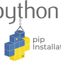
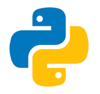

## 1. Objetivo do Presente Trabalho

::: {.justify}
O presente trabalho tem como objetivos apresentar os fundamentos e comandos essenciais do sistema de controle de versão **Git** e da plataforma de hospedagem remota de colaboração **GitHub**, de forma clara, objetiva e concisa, no que tange ao funcionamento de ambientes locais e sua integração com repositórios remotos.
:::

::: {.justify}
Ademais, é propósito do presente trabalho abordar tópicos introdutórios da linguagem **Python**, com foco em estruturas básicas, instalação de bibliotecas e usos práticos em contextos profissionais, educacionais e científicos.
:::

::: {.justify}
Dessa forma, buscou-se oferecer ao leitor documento simples e objetivo, apropriado a um primeiro contato com o "Universo Python", conferindo conhecimento suficiente para utilizar essa linguagem de programação na solução de problemas simples, bem como dispertar a sua curiosidade em conhecer outras ferramentas específicas, todas construídas com a linguagem Python.
:::

## 2. O Git – Sistema de Controle de Versão

{width=60% fig-align="center"}

::: {.justify}
O **Git** é uma ferramenta de linha de comando, destinada ao armazenamento, gerenciamento e controle de versões de aplicações computacionais. Abaixo, relacionou-se as suas principais características:
:::

- <u>Distribuído</u>: cada desenvolvedor possui uma cópia completa do repositório;
- <u>Desempenho elevado</u>, por meio de operações locais rápidas como `commit`, `diff`, `merge`;
- <u>Histórico rastreável</u>, por meio do hash SHA-1;
- <u>Branching leve e eficiente</u>;
- <u>Staging area</u>: área de preparação antes do commit;
- <u>Desfazer alterações</u>: comandos `reset`, `revert`, `checkout`;
- <u>Segurança criptográfica</u>:
- <u>Funciona offline</u>: e 
- <u>Integração com IDEs e pipelines</u>, dentre outras.

### 2.1 Comandos Essenciais do Git (Operações Locais)
::: {.justify}
O **Git** possui diversos comandos, destacando-se dentre eles aqueles a seguir apresentados, acompanhados de suscintas descrições de seu emprego:
:::

| Comando           | O que faz                                                                 | Exemplo de uso                                    |
|-------------------|---------------------------------------------------------------------------|---------------------------------------------------|
| `git init`        | Inicializa um novo repositório Git no diretório atual                     | `git init`                                        |
| `git add`         | Adiciona arquivos ao "staging area" para serem incluídos no próximo commit| `git add arquivo.md`                              |
| `git commit`      | Registra um snapshot do projeto com uma mensagem                          | `git commit -m "Adiciona seção de objetivos"`     |
| `git push`        | Envia os commits locais para o repositório remoto                         | `git push origin main`                            |
| `git pull`        | Busca e mescla alterações do repositório remoto para o local              | `git pull origin main`                            |
| `git clone`       | Cria uma cópia local de um repositório remoto                             | `git clone https://github.com/user/repo.git`      |
| `git status`      | Mostra o estado atual dos arquivos no repositório                         | `git status`                                      |
| `git log`         | Exibe o histórico de commits realizados                                   | `git log --oneline`                               |


## 3. O GitHub – Plataforma de Hospedagem e Colaboração

{width=40% fig-align="center"}

::: {.justify}
À semelhança do Git, o **GitHub** se apresenta como uma plataforma, via web e baseada no Git, possuindo recursos computacionais que propiciam atuação colaborativa entre seus usuários, apresentando as seguintes características:
:::

- <u>Hospedagem de repositórios remotos</u> (públicos e privados);
- <u>Interface amigável</u>, via navegador;
- <u>Pull Requests</u> - pedido formal para incorporar mudanças feitas em um branch (ramo de desenvolvimento) a outro - com revisão colaborativa;
- <u>Issues</u> (questões, problemas ou pendências) para controle de tarefas, dúvidas, erros, sugestões ou melhorias dentro de um repositório GitHub;
- <u>GitHub Actions</u> é a ferramenta de integração contínua (CI) e automação de fluxos de trabalho (CD), integrada ao próprio GitHub; 
- <u>Wiki e documentação integrada</u>;
- <u>Gerenciamento de permissões e equipes</u>;
- <u>Forks e contribuições externas</u>, que nada mais é que uma cópia independente de um repositório GitHub, próprio ou de outras pessoas, permitindo que se estude, edite, promovam-se melhorias sem afetar o projeto alheio, remetendo as alterações e/ou melhorias, por  meio do comando <u>Pull Request</u>; e
- <u>Estatísticas e gráficos de colaboração</u>, dentre outras caracter[isticas.]

### 3.1 Principais Ações no GitHub (Interface Web)
::: {.justify}
Relacionamos rol sumarizado de ações possíveis de serem realizadas no GitHub, como se segue:
:::

| Ação                    | Descrição                                                                                  |
|-------------------------|--------------------------------------------------------------------------------------------|
| *Criar repositório*     | Criação de projeto remoto                                                                 |
| *Fork*                   | Cópia de outro repositório para seu perfil                                                |
| *Pull Request (PR)*       | Proposta de alteração revisável                                                            |
| *Merge Pull Request*      | Incorporação de PR na branch principal                                                    |
| *Criar Issue*             | Registro de tarefa, sugestão ou erro                                                       |
| *Criar Wiki*              | Área de documentação colaborativa                                                          |
| *Criar Release*           | Versão estável com changelog                                                               |
| *Configurar Actions*      | Automatização de testes e deploy                                                           |
| *Gerenciar colaboradores* | Definir quem pode ler, editar e administrar                                                |

### 3.2 Principais Comandos do GitHub CLI (`gh`)
::: {.justify}
Seguem os principais comandos do GitHub, acompanhados de descrição sumária do seus respectivos empregos. 
:::

| Comando                            | Descrição                                                       |
|------------------------------------|------------------------------------------------------------------|
| `gh auth login`                    | Autenticação via navegador/token                                |
| `gh repo create`                   | Criação de repositório remoto via CLI                           |
| `gh repo clone <user>/<repo>`     | Clona um repositório GitHub                                     |
| `gh issue list` / `gh issue create`| Lista ou cria *issues*                                          |
| `gh pr create`                    | Cria um Pull Request                                             |
| `gh pr checkout <number>`         | Faz checkout local de uma PR específica                         |
| `gh pr merge`                     | Realiza o merge de uma PR                                       |
| `gh release create <tag>`         | Cria release com versão/tag                                     |
| `gh repo fork`                    | Faz fork de repositório                                         |
| `gh gist create`                  | Cria um *gist* (bloco de código público ou privado)             |

### 3.3 Exemplos com `gh` (linha de comando)
::: {.justify}
A seguir, seguem exemplos do emprego de alguns comandos do GitHub, mencionados acima:
:::
```bash
gh repo create nome-repositorio/documentacao-git --public --confirm
gh repo clone nome-repositorio/documentacao-git
gh issue create --title "Corrigir README" --body "Faltam instruções."
gh pr create --title "Nova função" --body "Inclui análise de risco." --base main

```

## 4. Gerenciador de Pacotes Python `pip`

{width=50% fig-align="center"}

::: {.justify}
O `pip` (Python Installer Package) é o gerenciador oficial de pacotes do Python, permitindo instalação, atualização e remoção de bibliotecas disponível no repositório **PyPI - Python Package Index**.
:::
::: {.justify}
### 4.1 Tabela de Comandos `pip`
:::
De forma bem sumária, apresentam-se alguns dos principais comandos da biblioteca pip, como se segue:

| Finalidade                        | Comando                                  | Exemplo                                       |
|----------------------------------|------------------------------------------|-----------------------------------------------|
| Instalar pacote                   | `pip install pacote`                     | `pip install pandas`                          |
| Instalar versão específica        | `pip install pacote==versão`             | `pip install numpy==1.23.5`                   |
| Instalar via `requirements.txt`  | `pip install -r arquivo.txt`             | `pip install -r requirements.txt`             |
| Instalar do GitHub               | `pip install git+URL`                    | `pip install git+https://github.com/repo.git` |
| Atualizar biblioteca             | `pip install --upgrade pacote`           | `pip install --upgrade matplotlib`            |
| Desinstalar pacote               | `pip uninstall pacote`                   | `pip uninstall flask`                         |
| Listar pacotes instalados        | `pip list`                               | `pip list`                                    |
| Mostrar detalhes de um pacote    | `pip show pacote`                        | `pip show scikit-learn`                       |
| Exportar lista de pacotes        | `pip freeze > requirements.txt`          | `pip freeze > requirements.txt`               |
| Atualizar o próprio `pip`        | `python -m pip install --upgrade pip`    | `python -m pip install --upgrade pip`         |
| Criar ambiente virtual           | `python -m venv nome`                    | `python -m venv venv`                         |
| Ativar (Windows)                 | `venv\Scripts\activate`                  | `venv\Scripts\activate`                       |
| Ativar (Linux/macOS)             | `source venv/bin/activate`               | `source venv/bin/activate`                    |


## 5. Conceitos Iniciais da Linguagem Python

{width=40% fig-align="center"}

::: {.justify}
Este tópico apresenta os fundamentos essenciais da linguagem de programação **Python**, utilizada amplamente em projetos de automação, ciência de dados, auditoria, aprendizado de máquina, desenvolvimento web e análise de informações públicas. Python destaca-se por sua sintaxe simples, legibilidade e extensa comunidade.
:::

### 5.1 Tipos de Dados Fundamentais

::: {.justify}
Os **tipos de dados** representam as diferentes categorias de valores que podem ser manipuladas em Python. Cada tipo define o comportamento e operações possíveis sobre o dado.
:::

| Tipo      | Descrição                                                                 | Exemplo            |
|-----------|---------------------------------------------------------------------------|--------------------|
| `int`     | Números inteiros, positivos ou negativos, sem parte decimal               | `idade = 42`       |
| `float`   | Números decimais com parte fracionária, com ponto como separador          | `salario = 5500.75`|
| `str`     | Cadeias de caracteres (textos), sempre entre aspas simples ou duplas      | `nome = "Pedro"`   |
| `bool`    | Valores booleanos, representando lógica binária (Verdadeiro/Falso)        | `ativo = True`     |

### 5.2 Variáveis e Operadores Básicos

::: {.justify}
As **variáveis** são nomes associados a valores que podem ser armazenados e manipulados ao longo da execução do programa. Os **operadores** realizam operações aritméticas, lógicas ou de comparação.
:::
#### 5.2.1 Exemplos de atribuição de valores a variáveis:
::: {.justify}
Seguem exemplos de atribuições a variáveis.
:::
```bash
  python
nome = "Jorge"
idade = 45
salario = 7200.50
ativo = True
```

#### 5.2.2 Principais operadores:
::: {.justify}
Abaixo, destacamos os principais operadores do **Python**:
:::
```bash
- Aritméticos: + (adição), - (subtração), * (multiplicação), / (divisão), // (divisão inteira), % (módulo), ** (exponenciação)

- Comparação: == (igual), != (diferente), <, >, <=, >=

- Lógicos: and, or, not — usados em expressões booleanas
```

### 5.2.3 Exemplos dos principais operadores do Python
::: {.justify}
A seguir, são apresentados exemplos do emprego dos diversos operadores do Phyton.
:::
####  - Operadores Aritméticos
```bash
Exemplos de operações aritméticas:

a = 10
b = 3

print(a + b)   # Soma: 13
print(a - b)   # Subtração: 7
print(a * b)   # Multiplicação: 30
print(a / b)   # Divisão com ponto flutuante: 3.333...
print(a // b)  # Divisão inteira: 3
print(a % b)   # Módulo (resto da divisão): 1
print(a ** b)  # Exponenciação: 10³ = 1000

```
####  - Operadores de Comparação

```bash
Exemplos de operações de comparação:
x = 5
y = 10

print(x == y)   # Igual a → False
print(x != y)   # Diferente de → True
print(x > y)    # Maior que → False
print(x < y)    # Menor que → True
print(x >= 5)   # Maior ou igual → True
print(y <= 10)  # Menor ou igual → True

```
####  - Operadores Lógicas

```bash
Exemplos de operações lógicas:
idade = 30
salario = 6000
 *Operador AND: ambas as condições devem ser verdadeiras*
    print(idade > 18 and salario > 5000)  
      True
 *Operador OR: basta uma condição ser verdadeira*
 erações de Comparação   print(idade < 18 or salario > 5000)   
      True
  *Operador NOT: inverte o valor lógico*
    print(not idade < 18)                 
      True (porque idade < 18 é False)
```

## 6. Estruturas de Dados: Listas, Tuplas e Dicionários
::: {.justify}
As estruturas de dados armazenam coleções de valores, permitindo organizar e acessar múltiplos itens de forma eficiente.
:::

### 6.1 Listas (list)
::: {.justify}
As estruturas de dados que **armazenam coleções de valores**, permitindo organizar e acessar múltiplos itens de forma eficiente.
:::

```bash

cargos = ["Auditor", "Analista", "Técnico"]

```

### 6.2 Tuplas (tuple)
::: {.justify}
Coleção ordenada e **imutável**. Usada para **dados que não devem ser alterados**.
:::

```bash

valores = (10, 20, 30)

```

### 6.3 Dicionário (dict)
::: {.justify}
Coleção não ordenada de **pares chave:valor**. Muito útil para **representar entidades nomeadas**.
:::

```bash

servidor = {"nome": "Jorge", "cargo": "Auditor", "ativo": True}

```
::: {.justify}
Um **iterável** é um *objeto pelo qual podemos iterar*. Basicamente, uma boa regra prática é que se o *objeto deve ser uma coleção de outros objetos*, é muito provável que *queiramos tratá-los todos da mesma maneira, mas talvez não todos ao mesmo tempo*, sendo assim um *objeto iterável* e iremos iterar sobre ele com, um "laço for" - que será visto posteriormente, em tópico específico. 
:::

## 7. Estruturas de Controle 
::: {.justify}
As estruturas de controle permitem definir o fluxo de execução do programa, com base em condições ou repetições.
:::

### 7.1 Estruturas Condicionais
::: {.justify}
Usadas para executar blocos de código com base em uma condição lógica.
:::

```bash
if idade >= 60:     # condição a ser analisada, obrigatoriamente.
    print("Idoso")
elif idade >= 18:   # condição 'if' alternativa a ser avaliada, quando necessário.
    print("Adulto")
else:               # condição residual, que pode ou não existir.
    print("Menor de idade")
```
::: {.justify}
Exemplo de bloco de código, representando uma condição lógica.
:::
```bash
if idade >= 60:
    print("Idoso")
elif idade >= 18:
    print("Adulto")
else:
    print("Menor de idade")
```
### 7.2 Estruturas de Repetição
::: {.justify}
Usados para executar blocos de código múltiplas vezes. Pode ser realizada com o comando *for* ou 
com o comando *while*. No caso do laço com *for*, o número de repetições é pré-definido; ao passo 
que o laço *while* se repete até quando a condição se concretize.
:::
```bash
for cargo in cargos:
    print(cargo)

i = 0
while i < 3:
    print(valores[i])
    i += 1
```

## 8. Funções 
::: {.justify}
As funções são blocos de código nomeados que podem ser chamados para realizar tarefas específicas. Promovem reutilização, clareza e modularização.
:::

```bash
def somar(a, b):
    return a + b

resultado = somar(10, 5)  # saída: 15

onde:
- **def** inicia a definição da função;

- os valores que a função recebe são os **parâmetros da função** (a e b, no caso em questão); e 

- **return** define o valor de saída da função.

```
## 9. Importação de Bibliotecas externas ao Python

::: {.justify}
As bibliotecas contêm funções e classes prontas para tarefas específicas. Usar import permite incluir essas ferramentas no seu código, potencializando o emprego de ferramentas criadas em Python, porém destinadas a propósitos específicos.
:::

```bash
import math
print(math.sqrt(25))  # saída: 5.0
```
::: {.justify}
É possível tanto importar tanto bibliotecas nativas (como math), quanto bibliotecas externas (como Pandas, Numpy e Matplotlib, por exemplo), instaladas por meio do pip (comando *pip install*).
:::

::: {.justify}
Há diversas bibliotecas de caráter específico, a exemplo da biblioteca Pandas. Por meio do commando "import pandas as pd", é possível cria um dataframe, que apresenta forma de planilha, porem podendo realizar "query's", qua nada mais são que consultas estruturadas entre dados colunares, se assemelhando muito às consultas do SQL (seleção de dados, em uma ou mais tabelas, conforme regras pré-definidas)
:::
{width=70% fig-align="center"}


::: {.justify}
De igaul modo, ressaltamos outras bibliotecas específicas, todas baseadas em Python, a exemplo das bibliotecas **Numpy**, **Mathplotlib**, **Seaborn**, **Keras**, sendo fundamentais para projetos como ciência de dados, automação de processos, aprendizado de máquina, raspagem de dados da web, etc.
:::

{width=30% fig-align="left"} {width=30% fig-align="rigth"}

{width=30% fig-align="left"}         {width=30% fig-align="rigth"}

::: {.justify}
A seguir, exemplicamos o emprego da biblioteca Numpy.
:::
```bash
import numpy as np

# Cria uma lista de números
valores = [10, 20, 30, 40, 50]

# Converte a lista em um array NumPy
array_valores = np.array(valores)

# Calcula a média dos valores
media = np.mean(array_valores)

print(f"A média dos valores é: {media}")

```

